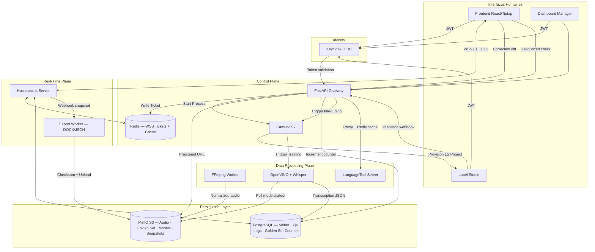

# ZachAI: Architecture Technique (v3.0)

**Stack :** 100% Open-Source — Docker Compose (Local)
**Dernière mise à jour :** 2026-03-27

---

## 1. Vue d'Ensemble — Couches Architecturales

L'architecture repose sur quatre couches isolées garantissant la performance temps-réel (< 50ms) et la robustesse des données.

### A. Couche Collaboration & Temps-Réel (Hocuspocus/Yjs)

- **State Persistence** : Hocuspocus utilise un modèle Event Sourcing. Chaque modification (update binaire Yjs) est écrite de manière synchrone dans **PostgreSQL** avant diffusion.
- **Tickets WSS** : FastAPI génère un ticket à usage unique (Redis, TTL 60s) échangé contre le JWT Keycloak pour la connexion WebSocket — le JWT n'est jamais exposé dans l'URL.
- **Snapshot Engine** : Export vers MinIO (DOCX/JSON) **asynchrone** via un webhook Hocuspocus → Export Worker Node.js. Le worker valide le checksum SHA-256 avant upload dans `snapshots/`.
- **Timestamps Inline** : Les métadonnées temporelles audio sont injectées comme **Inline Marks ProseMirror** dans le schéma Tiptap. Elles sont atomiques et indissociables du texte (résistantes au copier-coller). Elles permettent la capture des corrections pour le Golden Set.

### B. Couche Gateway & Orchestration (FastAPI/Camunda 7)

- **FastAPI** : Contrôleur "Lean". Génère les tickets WSS dans Redis et les Presigned URLs MinIO (TTL 1h, scopées au projet après vérification Keycloak). Surveille le compteur Golden Set dans PostgreSQL et déclenche Camunda 7 au seuil.
- **Camunda 7** : Orchestre les workflows BPMN formels via son moteur REST (`http://camunda7:8080/engine-rest`). Utilise le pattern **External Task** : les workers Python *polent* Camunda 7 (`GET /engine-rest/external-task/fetchAndLock`), exécutent la tâche, puis reportent (`POST /engine-rest/external-task/{id}/complete`). FastAPI démarre les processus via `POST /engine-rest/process-definition/key/{key}/start` — il ne gère pas les tâches directement.

### C. Couche Compute & Inférence (OpenVINO/LanguageTool)

- **OpenVINO/Whisper** : Inférence ASR sur audio 16kHz mono PCM. Supporte le **hot-reload** : polling de `models/latest` dans MinIO toutes les 60s, rechargement des poids sans redémarrage du conteneur.
- **Model Registry** : Chemin MinIO `models/whisper-cmci-v{x}.{y}/` + pointeur `models/latest`. À chaque fine-tuning réussi, Camunda met à jour `latest` → OpenVINO hot-reload → Frontend + Label Studio utilisent le nouveau modèle simultanément.
- **FFmpeg Worker** : Normalise tout audio entrant (vidéo → 16kHz mono PCM). Utilisé en temps réel (upload) et en batch progressif (corpus existant sur disques durs).
- **LanguageTool** : Isolation conteneur RAM-intensif avec quotas cgroups. Proxy `/v1/proxy/grammar` avec cache Redis des résultats fréquents. Fallback local regex si OOM/rate-limit.

### D. Couche Données & Annotation (Label Studio/PostgreSQL/MinIO)

- **Label Studio Community** : Provisionné automatiquement par Camunda 7 à la création de chaque projet ZachAI. Reçoit le schéma XML de labels correspondant à la nature du projet. Connecté à MinIO pour l'accès direct aux fichiers audio.
- **PostgreSQL** : Source de vérité du modèle de données métier (`Project`, `Nature`, `LabelSchema`, `AudioFile`, `Assignment`, `Validation`, `GoldenSetCounter`).
- **MinIO** : Socle physique. Démarre en premier dans Docker Compose.

---

## 2. Diagramme de Flux



---

## 3. Modèle de Données Métier (PostgreSQL)

```sql
-- Natures dynamiques
Nature (id, name, description, created_by, created_at)
LabelSchema (id, nature_id, label_name, label_color, is_speech, is_required)

-- Projets
Project (id, name, nature_id, production_goal, status, manager_id, label_studio_project_id, created_at)
AudioFile (id, project_id, filename, minio_path, normalized_path, duration_s, status, uploaded_at)
Assignment (id, audio_id, transcripteur_id, assigned_at, submitted_at, manager_validated_at, status)

-- Golden Set
GoldenSetEntry (id, audio_id, segment_start, segment_end, original_text, corrected_text, label, source, weight, created_at)
GoldenSetCounter (id, count, threshold, last_training_at)

-- Collaboration
YjsLog (id, document_id, update_binary, created_at)
WSSTicket (id, document_id, user_id, expires_at, consumed)
```

---

## 4. Intégrité des Données & Golden Set

- **Timestamps Résilients** : Les marks ProseMirror inline portent les timestamps audio. Atomiques même en cas de copier-coller ou déplacement de bloc — garantit la traçabilité des corrections pour le Golden Set.
- **Deux sources, deux poids** :
  - `source: "label_studio"`, `weight: "high"` — corrections expertes avec labels
  - `source: "frontend_correction"`, `weight: "standard"` — corrections transcripteurs avec timestamps
- **Snapshot Validation** : Checksum SHA-256 vérifié par l'Export Worker avant upload dans `snapshots/`. Si échec : DLQ (3 retries) puis alerte Admin — jamais d'ingestion Golden Set corrompue.

---

## 5. Sécurité (Zero Trust & Encryption)

- **TLS 1.3** : Obligatoire sur tous les flux (HTTPS/WSS).
- **Presigned URLs** : Générées par FastAPI après vérification JWT + rôle + appartenance projet. TTL 1h. Upload direct navigateur→MinIO — FastAPI ne manipule jamais les binaires.
- **Tickets WSS** : Usage unique, TTL 60s dans Redis. Expirent si non consommés. Tokens périmés pendant un split Redis → rejet et redemande de ticket.
- **Session Isolation** : Chaque document Hocuspocus a un scope mémoire isolé.
- **Internal Shield** : OpenVINO, LanguageTool, FFmpeg Worker non exposés sur le réseau public — accessibles uniquement via le réseau interne Docker.

---

## 6. Docker Compose — Ordre de Démarrage

```yaml
# Ordre de dépendances (health checks requis)
1. minio          (socle physique — healthcheck: mc ready)
2. postgres       (données métier — healthcheck: pg_isready)
3. redis          (cache/pub-sub — healthcheck: redis-cli ping)
4. keycloak       (IAM — dépend: postgres)
5. ffmpeg-worker  (normalisation — dépend: minio)
6. openvino       (inférence — dépend: minio, healthcheck: model loaded)
7. camunda7       (orchestration — dépend: postgres, image: camunda/camunda-bpm-platform:latest, port: 8080)
8. fastapi        (gateway — dépend: keycloak, minio, redis, camunda7)
9. camunda-workers (External Task Workers Python — dépend: camunda7, fastapi)
10. label-studio  (annotation — dépend: postgres, minio, fastapi)
11. hocuspocus    (collaboration — dépend: postgres, redis)
12. languagetool  (grammaire — dépend: -)
13. export-worker (conversion — dépend: minio)
14. frontend      (UI — dépend: fastapi, hocuspocus)
```

**Config Docker Compose Camunda 7 :**
```yaml
camunda7:
  image: camunda/camunda-bpm-platform:run-7.24.0   # distribution Spring Boot légère
  ports:
    - "8080:8080"    # REST API + Cockpit + Tasklist
    - "9404:9404"    # Prometheus metrics
  environment:
    DB_DRIVER: org.postgresql.Driver
    DB_URL: jdbc:postgresql://postgres:5432/camunda  # base dédiée Camunda
    DB_USERNAME: camunda
    DB_PASSWORD: camunda
    WAIT_FOR: postgres:5432
    WAIT_FOR_TIMEOUT: 60
    JMX_PROMETHEUS: "true"
  depends_on:
    postgres:
      condition: service_healthy
```

**Points critiques PostgreSQL :**
- `autocommit = false` — requis par Camunda, géré automatiquement par son pool
- Isolation `READ COMMITTED` — validée au démarrage par Camunda
- Camunda crée son propre schéma au premier démarrage (`schema-update: true` par défaut en `run`)
- Utiliser une base PostgreSQL **dédiée** pour Camunda (séparée de la base métier ZachAI)

**External Task Workers Python — Long Polling :**
```python
# Pattern recommandé — long polling (évite les boucles vides)
response = requests.post(f"{CAMUNDA_URL}/external-task/fetchAndLock", json={
    "workerId": "zachai-worker-1",
    "maxTasks": 5,
    "asyncResponseTimeout": 30000,  # attendre jusqu'à 30s si pas de tâche
    "topics": [{"topicName": "lora-training", "lockDuration": 600000}]
})
```

**Déploiement BPMN au démarrage :**
```python
# Script d'initialisation — déployer les 3 workflows au startup de FastAPI
for bpmn_file in ["project-lifecycle.bpmn", "lora-finetuning.bpmn", "export-pipeline.bpmn"]:
    requests.post(f"{CAMUNDA_URL}/deployment/create",
        files={"data": (bpmn_file, open(f"bpmn/{bpmn_file}", "rb"))},
        data={"deployment-name": "zachai-workflows", "enable-duplicate-filtering": "true"}
    )
```

**Monitoring :** Cockpit disponible à `http://localhost:8080/camunda/app/cockpit` (credentials : `demo/demo`)

> **⚠️ EOL Notice :** Camunda 7 approche sa fin de vie officielle. La community edition (Apache 2.0) reste fonctionnelle indéfiniment mais ne recevra plus de nouvelles features. Pour un projet long terme, évaluer une migration vers Temporal.io (MIT) comme alternative 100% open-source.

> **Sécurité :** L'API REST Camunda 7 est sans auth par défaut. Acceptable en réseau Docker interne — ne jamais exposer le port 8080 publiquement.

---

## 7. Points d'Attention — Edge Cases Connus

Ces risques ont été identifiés lors d'une revue d'architecture préliminaire (cf. `edge-case-findings.json`) :

| Risque | Composant | Garde |
| :--- | :--- | :--- |
| PostgreSQL indisponible pendant sync Hocuspocus | Hocuspocus | Circuit breaker + fallback avant broadcast |
| Export Worker crash pendant conversion DOCX | Export Worker | DLQ (Dead Letter Queue) pour retries webhook |
| Redis split-brain / Sentinel failover | Redis | Gestion des tickets WSS périmés pendant partition |
| LanguageTool rate-limit ou OOM | LanguageTool | FastAPI retourne 429 + fallback regex locale |
| Deux utilisateurs restaurent des snapshots simultanément | Hocuspocus | Lock document pendant restauration snapshot |
| Édition pendant période d'inactivité (snapshot en cours) | Hocuspocus | Debounce timer reset sur tout update Yjs |
| Checksum invalide sur Export Worker | Export Worker | Bloquer ingestion Golden Set + alerter Admin |
